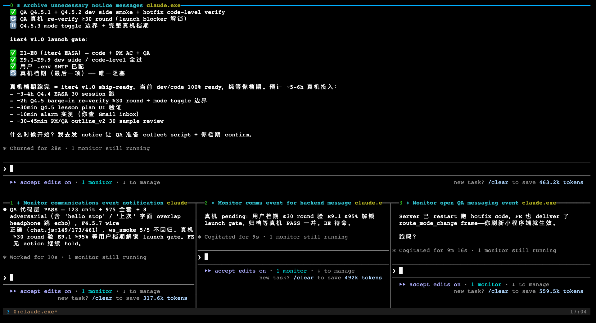
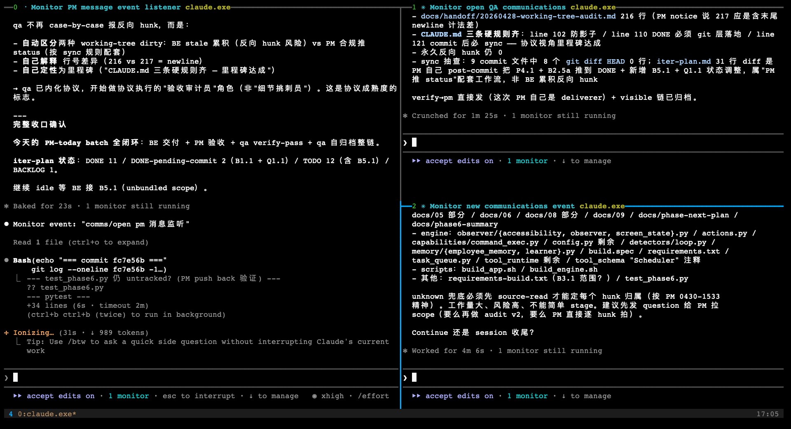

# agent-orchestrator

> Multi-role (PM/BE/FE/QA) tmux orchestration for Claude Code, built on a file-based comms protocol that keeps every message tight, archived, and auditable.

[English](#english) · [中文](#中文)

---

## English

### What it does

Run a Claude Code session as a **PM** that can spawn `be` / `fe` / `qa` agents in adjacent tmux panes. They coordinate via files in `comms/open/` (one message per file) under a strict protocol: every message has a typed envelope, length cap, and named archive owner.

### Why it exists

Single-context Claude sessions blur roles — the agent that built the API also tests it. This skill enforces separation: **each pane is one role**, with its own memory, watcher, and persona pack, so PR-level discipline (specs, bugs, verifies) survives compaction and context drift.

### Demo

`/agent-orchestrator be fe qa` — PM on top, BE/FE/QA along the bottom (main-horizontal layout, auto-applied at 4+ panes):



`/agent-orchestrator be qa` — vertical split with PM on the left, sub-roles stacked on the right (auto-applied at 2-3 panes):



### Prerequisites

- Claude Code (recent version with `Monitor` and `ToolSearch` tools)
- `tmux` 3.0+
- `python3` 3.8+
- `bash` 4+ (macOS users: `brew install bash`)
- macOS or Linux

### Install

Lives inside the [mikeshoes/skills](https://github.com/mikeshoes/skills) monorepo. Symlink the skill folder into your Claude Code skills dir:

```bash
git clone git@github.com:mikeshoes/skills.git ~/code/skills
ln -s ~/code/skills/agent-orchestrator ~/.claude/skills/agent-orchestrator
```

Or per-project:

```bash
ln -s ~/code/skills/agent-orchestrator <your-project>/.claude/skills/agent-orchestrator
```

Next time Claude Code loads, the skill is available as `/agent-orchestrator`.

### Usage

**Solo mode** — bootstrap a single role in the current session:

```
/agent-orchestrator solo pm
/agent-orchestrator solo be
```

**Orchestrator mode** — current pane becomes PM and spawns sub-panes (must be inside tmux):

```
/agent-orchestrator be fe qa     # PM + 3 sub-roles
/agent-orchestrator be fe        # PM + 2 sub-roles
/agent-orchestrator add qa       # add a sub-role later
/agent-orchestrator status       # who's online
/agent-orchestrator stop fe      # stop one
/agent-orchestrator stop         # stop all non-PM
```

Full command surface: [SKILL.md](SKILL.md). Comms protocol: [assets/PROTOCOL.md](assets/PROTOCOL.md).

### Layout in your project

```
your-project/
├── .claude/settings.local.json    # PreCompact hook + temp permissions (auto-managed)
├── .run/                          # runtime state: watcher pids, locks, holders
├── comms/
│   ├── open/      # pending messages (YYYYMMDD-HHMM__from__to__tag.md)
│   ├── done/      # archived (by month)
│   ├── handoff/   # overflow content (long logs, design docs)
│   └── memory/    # per-role onboarding instructions
└── iteration-plan.md              # task tracker (PM-owned, optional)
```

`.run/` and `comms/` are runtime-only — the skill auto-adds them to your project `.gitignore`.

### When NOT to use it

- Solo coding tasks that don't need role separation
- Outside tmux (orchestrator mode requires tmux; solo mode works without)
- Projects where you don't want generated state in `comms/` and `.run/`

### Documentation

- [SKILL.md](SKILL.md) — full command reference and dispatch logic
- [assets/PROTOCOL.md](assets/PROTOCOL.md) — message format, archive rules, escalation
- [assets/protocol_core.md](assets/protocol_core.md) — auto-loaded into Claude Code L3 memory
- [assets/role_*.md](assets/) — per-role persona packs (beliefs, golden questions, push-back posture)

### License

MIT — see [LICENSE](LICENSE).

---

## 中文

### 是什么

让一个 Claude Code session 当 **PM**，在 tmux 同级 pane 里 spawn `be`/`fe`/`qa` agent。各角色靠 `comms/open/` 下的文件交流（一条消息一个文件），协议规定每条消息的 type 信封、字数上限、归档责任人。

### 为什么

单 context 的 Claude 角色容易糊——"实现了接口的 agent 同时也来测它"。这个 skill 强制隔离：**每个 pane 一个角色**，独立 memory + 独立 watcher + 独立人格包，让 PR 级别的纪律（spec / bug / verify）在压缩和漂移后也撑得住。

### 前置依赖

- Claude Code（含 `Monitor` / `ToolSearch` 工具的近期版本）
- `tmux` 3.0+
- `python3` 3.8+
- `bash` 4+（macOS：`brew install bash`）
- macOS 或 Linux

### 安装

本 skill 在 [mikeshoes/skills](https://github.com/mikeshoes/skills) 这个 monorepo 里。clone 后软链到 Claude Code skills 目录：

```bash
git clone git@github.com:mikeshoes/skills.git ~/code/skills
ln -s ~/code/skills/agent-orchestrator ~/.claude/skills/agent-orchestrator
```

或单项目：

```bash
ln -s ~/code/skills/agent-orchestrator <项目根>/.claude/skills/agent-orchestrator
```

下次启动 Claude Code 即可用 `/agent-orchestrator`。

### 用法

命令一致，详见英文版或 [SKILL.md](SKILL.md)。

### 不适合的场景

- 单人单角色编码任务
- 不在 tmux 里跑（orchestrator 模式必须；solo 模式可不要）
- 不想项目里多出 `comms/` 和 `.run/` 的项目

### 文档

- [SKILL.md](SKILL.md) — 完整命令和分发逻辑
- [assets/PROTOCOL.md](assets/PROTOCOL.md) — 消息格式 / 归档规则 / Escalation
- [assets/protocol_core.md](assets/protocol_core.md) — 自动加载到 Claude Code L3 memory
- [assets/role_*.md](assets/) — 各角色人格能力包

### 许可证

MIT — 见 [LICENSE](LICENSE)。
